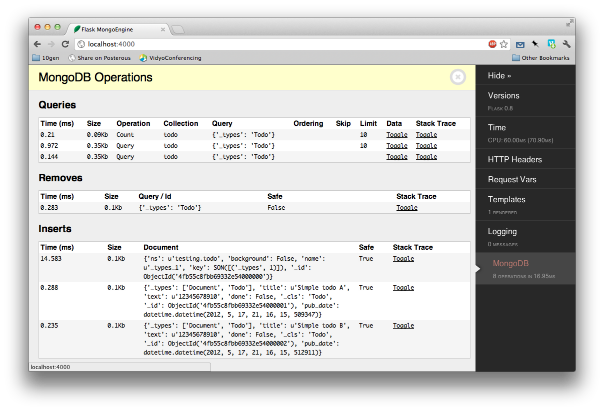

# Flask-MongoEngine

Flask-MongoEngine 是一个提供集成MongoEngine功能的Flask插件。更多关于MongoEngine的信息请查阅MongoEngine的文档。

它会管理您App的数据库连接。您也可以使用WTForms作为您模型的表单模型。

# 安装 Flask-MongoEngine

Install with **pip**:

    pip install flask-mongoengine

# 配置

基本配置十分简单，只需导入扩展：

    from flask import Flask
    from flask_mongoengine import MongoEngine

    app = Flask(__name__)
    app.config.from_pyfile('the-config.cfg')
    db = MongoEngine(app)

或者您也可以在app加载之前设置好数据库，这在应用工厂方法时非常有用。

    from flask import Flask
    from flask_mongoengine import MongoEngine
    db = MongoEngine()
    ...
    app = Flask(__name__)
    app.config.from_pyfile('the-config.cfg')
    db.init_app(app)

默认情况下，Flask-MongoEngine认为 `Mongod` 运行在 `localhost` 的 `27107` 端口，并且连接到数据库`test`。

如果MongoDB在别处运行，您应该在 `app.config` 文件中的 `'MONGODB_SETTINGS'` 字典对象中设置 `host` 与 `port`

    app.config['MONGODB_SETTINGS'] = {
        'db': 'project1',
        'host': '192.168.1.35',
        'port': 12345
    }

如果数据库需要认证，那么用户名和密码参数也应该在`app.config`的`MONGODB_SETTINGS`中提供：

    app.config['MONGODB_SETTINGS'] = {
        'db': 'project1',
        'username':'webapp',
        'password':'pwd123'
    }

Uri风格的连接字符串同样被支持，只需把Uri放到 `app.config` 的 `MONGODB_SETTINGS` 中的 `host`中。注意Uri中的数据库名字优先级高于 `name` 键中的名字。

    app.config['MONGODB_SETTINGS'] = {
        'db': 'project1',
        'host': 'mongodb://localhost/database_name'
    }

连接设置也可以在 `app.config` 中以 `MONGODB_` 前缀来提供。

    app.config['MONGODB_DB'] = 'project1'
    app.config['MONGODB_HOST'] = '192.168.1.35'
    app.config['MONGODB_PORT'] = 12345
    app.config['MONGODB_USERNAME'] = 'webapp'
    app.config['MONGODB_PASSWORD'] = 'pwd123'

# Custom Queryset

flask-mongoengine将以下方法附加到MongoEngine的标准查询中。

* **get\_or\_404**: 与 .get() 一样，当时在对象不存在时直接调用 `abort(404)`
* **first\_or\_404**: 通上一条相同，只是对应 .first()
* **paginate**: 对QuerySet进行分页，需要两个参数，分别是`page`与`per_page`
* **paginate\_field**: 对QuerySet中的一个字段分页。参数有: field_name, doc_id, page, per_page.

## 示例:

    # 如果对象不存在则404
    def view_todo(todo_id):
        todo = Todo.objects.get_or_404(_id=todo_id)
    ..

    # 对Todo进行分页
    def view_todos(page=1):
        paginated_todos = Todo.objects.paginate(page=page, per_page=10)

    # 对Todo的Id进行分页
    def view_todo_tags(todo_id, page=1):
        todo = Todo.objects.get_or_404(_id=todo_id)
        paginated_tags = todo.paginate_field('tags', page, per_page=10)

分页对象的属性包括：iter\_pages, next, prev, has\_next, has\_prev, next\_num, prev\_num.

在模板中:

    
    

    
        
        
            <a href="{{ url_for(endpoint, page=page) }}">{{ page }}</a>
        
            <strong>{{ page }}</strong>
        
        
        …
        
    
    

    

# MongoEngine 与 WTForms

flask-mongoengine自动从MongoEngine的模型中生成WTForms：

    from flask_mongoengine.wtf import model_form

    class User(db.Document):
        email = db.StringField(required=True)
        first_name = db.StringField(max_length=50)
        last_name = db.StringField(max_length=50)

    class Content(db.EmbeddedDocument):
        text = db.StringField()
        lang = db.StringField(max_length=3)

    class Post(db.Document):
        title = db.StringField(max_length=120, required=True, validators=[validators.InputRequired(message=u'Missing title.'),])
        author = db.ReferenceField(User)
        tags = db.ListField(db.StringField(max_length=30))
        content = db.EmbeddedDocumentField(Content)

    PostForm = model_form(Post)

    def add_post(request):
        form = PostForm(request.POST)
        if request.method == 'POST' and form.validate():
            # do something
            redirect('done')
        return render_template('add_post.html', form=form)

对于MongoEngine中的字段，系统会选中最恰当的WTForm字段来转换。当不是显式转换时，用户可以使用参数来指定。

    PostForm = model_form(Post, field_args={'title': {'textarea': True}})

## Supported parameters:

对于选择性字段:

* multiple to use a SelectMultipleField
* radio to use a RadioField

对于字符字段 StringField:

* password to use a PasswordField
* textarea to use a TextAreaField

(默认情况下，一个StringField仅仅在没有max_length最大长度的情况下才会被转化成TextAreaField)

## Supported fields
* StringField
* BinaryField
* URLField
* EmailField
* IntField
* FloatField
* DecimalField
* BooleanField
* DateTimeField
* ListField (using wtforms.fields.FieldList )
* SortedListField (duplicate ListField)
* EmbeddedDocumentField (using wtforms.fields.FormField and generating inline Form)
* ReferenceField (using wtforms.fields.SelectFieldBase with options loaded from QuerySet or Document)
* DictField
* Not currently supported field types:
* ObjectIdField
* GeoLocationField
* GenericReferenceField

# Session 接口

让MongoEngine作为您的session后端来储存简单设置与session接口：

    from flask_mongoengine import MongoEngine, MongoEngineSessionInterface

    app = Flask(__name__)
    db = MongoEngine(app)
    app.session_interface = MongoEngineSessionInterface(db)

# Debug 工具面板

如果您使用Flask-DebugToolbar那么您可以添加`'flask_mongoengine.panels.MongoDebugPanel'` 到 `DEBUG_TB_PANELS` 的配置列表中，然后它就会自动追踪您的查询请求。

    from flask import Flask
    from flask_debugtoolbar import DebugToolbarExtension

    app = Flask(__name__)
    app.config['DEBUG_TB_PANELS'] = ['flask_mongoengine.panels.MongoDebugPanel']
    db = MongoEngine(app)
    toolbar = DebugToolbarExtension(app)
    Upgrading
    0.6 to 0.7
    ListFieldPagination order of arguments have been changed to be more logical:

    # Old order
    ListFieldPagination(self, queryset, field_name, doc_id, page, per_page, total)

    # New order
    ListFieldPagination(self, queryset, doc_id, field_name, page, per_page, total)

# 鸣谢

受以下两个Repo启发:

[danjac](https://bitbucket.org/danjac/flask-mongoengine) [maratfm](https://bitbucket.org/maratfm/wtforms)
